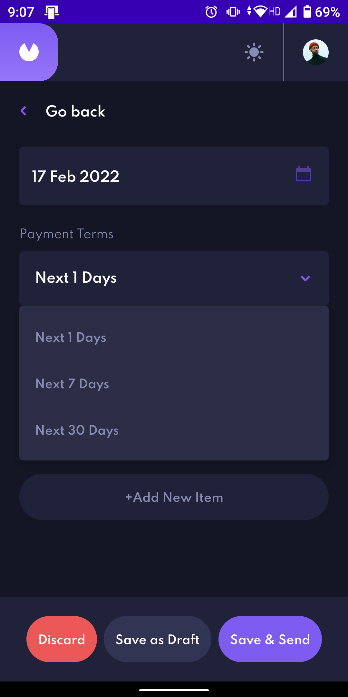

# Accounting App
## An Android app built with Kotlin, Material, Jetpack Compose, Hilt, Room, Coroutines, Data-Store, MVVM-Clean Architecture and JUnit tests

 

### 🎨 Design files are available in [/design](design) folder if you want to try it yourself.

 

## Uses
* [Kotlin](https://developer.android.com/kotlin)
* [Material](https://material.io)
* [Jetpack Compose](https://developer.android.com/jetpack/compose)
* [Hilt](https://dagger.dev/hilt)
* [Room](https://developer.android.com/jetpack/androidx/releases/room)
* [Coroutines](https://developer.android.com/kotlin/coroutines)
* [Data-Store](https://developer.android.com/topic/libraries/architecture/datastore)
* [Jetpack Architecture Components](https://developer.android.com/jetpack/guide)
* [JUnit](https://developer.android.com/training/testing/local-tests)

## Screenshots

  
  
  

 
 
 

  
  
  
  
  

 
 
 

  
  
  

 
 
 

  
  
  
  
  

